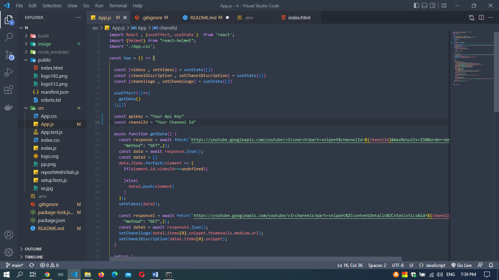

*Youtube template Documentation*

After purchase this site template,

    If you don’t have Node Js installed in
your computer go and install it buy this link :-[https://nodejs.org/en/download/](https://nodejs.org/en/download/)

    After
installing it on your computer the next thing you have to do is install the npm
packages need for this template to work you can do it simply by executing “ npm
I “ command on your terminal/cmd relevant to the your project folder If you
need anything more than that link :-[https://docs.npmjs.com/about-npm](https://docs.npmjs.com/about-npm)

    Then you can add your you tube data v3
api key into your react js template to get an api key link :-[https://console.cloud.google.com/apis/dashboard](https://console.cloud.google.com/apis/dashboard)
if you dont know how to do it use this link for it :- [https://blog.hubspot.com/website/how-to-get-youtube-api-key](https://blog.hubspot.com/website/how-to-get-youtube-api-key)

    After you getting your api key update
it on “project location/src/app.js”

In 15^th line.

    After
you update it get channel id by this link :-[https://youtu.be/D12v4rTtiYM](https://youtu.be/D12v4rTtiYM)
and update it

In 16^th line.

Now website is
ready you can deploy it very easily by using this link :- [https://blog.logrocket.com/8-ways-deploy-react-app-free/#:~:text=For%20your%20React%20app%2C%20you,whenever%20you%20push%20your%20changes](https://blog.logrocket.com/8-ways-deploy-react-app-free/#:~:text=For%20your%20React%20app%2C%20you,whenever%20you%20push%20your%20changes).

If you need
more changes you have freedom for change colors paddings font size font styles
every thing you can do by changing “proje ct location/src/app.css”

